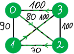

## Abstract

> Given a matrix of costs and assuming that there are no loops or insulated vertices and edges are bidirectional, 
> find the minimum Hamiltonian cycle in a full weighted graph. Parallelize solution to finally reach the greater
> time-efficiency.

## Details

The greedy algorithm was implemented in two ways: sequential and parallel. Generally, we need to check 
**_(n-1)!/2_** permutations for **_n_ cities** as we will see later.

The first is a standard one when we need to consider every possible permutation of vertices, updating the lowest
total cost if possible. Parallel implementation is based on sequential one, but it's simply divide & conquer.

Without losing generalization, we can say that we always starts and stops in city which ID is 0 and n is the
number of cities, because path should consists of every cities and from the algorithm perspective there is no big
difference between solutions _(c1, c2, ..., cn), (c2, c3, ..., cn, c1), ..., (cn, c1, c2, ..., c(n-1))_.
Remaining _(n-1)!_ paths to check can be split into _n-1_ independent sets of permutations which have _(n-2)!_
elements each.

Let's consider that we have a connection between 4 cities as below and we are starting at 0 (which means that
we always have 0 as first and last city of the path).

**Sequential approach**

_(4-1)! = 3! = 6_ permutations at maximum should be checked to find the best path:

| Path            | Cost    |
| --------------- | ------- |
| (0, 1, 2, 3, 0) | 360     |
| (0, 1, 3, 2, 0) | 370     |
| (0, 2, 1, 3, 0) | **350** |
| (0, 2, 3, 1, 0) | 370     |
| (0, 3, 1, 2, 0) | **350** |
| (0, 3, 2, 1, 0) | 360     |

Here we go. _350_ is the value we've been searching for.

But wait, shouldn't we simplify something? It's easy to see that each cost appears twice. Uh, of course.
The cost is the same for some path and its reverse. So wee need to check _(4-1)! / 2 = 3_ permutations.

- [Sequential diagram](sequence_operation_diagram.pdf)

**Parallel approach**

Where can we find a nice place to insert threads? They can do the job simultaneously selecting their own
best paths from _(n-2)!_ possible ones. Why not from _(n-1)!_? Because we need to have _n-1_ portions of
permutations for threads to share the work. Next we just need to compare those _n-1_ solutions and select
the best one of them which is the result of the algorithm. Should we use _n-1_ threads exactly? No.
The implement solution should run from _2_ up to _n-1_ threads, because it has built-in mechanism of laps
in which threads receives permutation to work with or not, considering _threads number_ modulo of _n-1_.

- [Parralel diagram](parallel_operation_diagram.pdf)

**Which one's better?**

Both ways have pros and cons. The first allow to limit the memory usage of the solution, but lacks of highly
ineffective time of calculation. The second allows to speed up the process, but requires a lot more memory and
additional libraries to run. But, in fact, the proposed solution could be applicable for academic solution only,
because of it is still big time-consumer.
